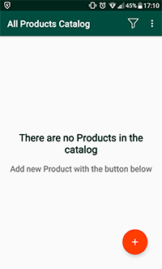
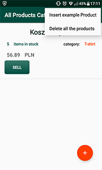
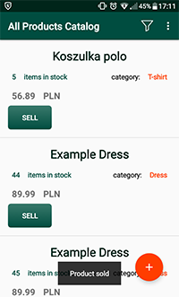
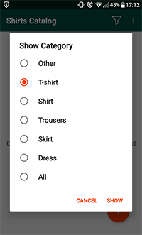

**ClothesStoreApp**

It's the final project made as a part of Android Basics by Google Nanodegree Program.

Inventory app, that stores information for clothes shop.
Application built using SQLite database, ContentProvider and CursorLoader.

